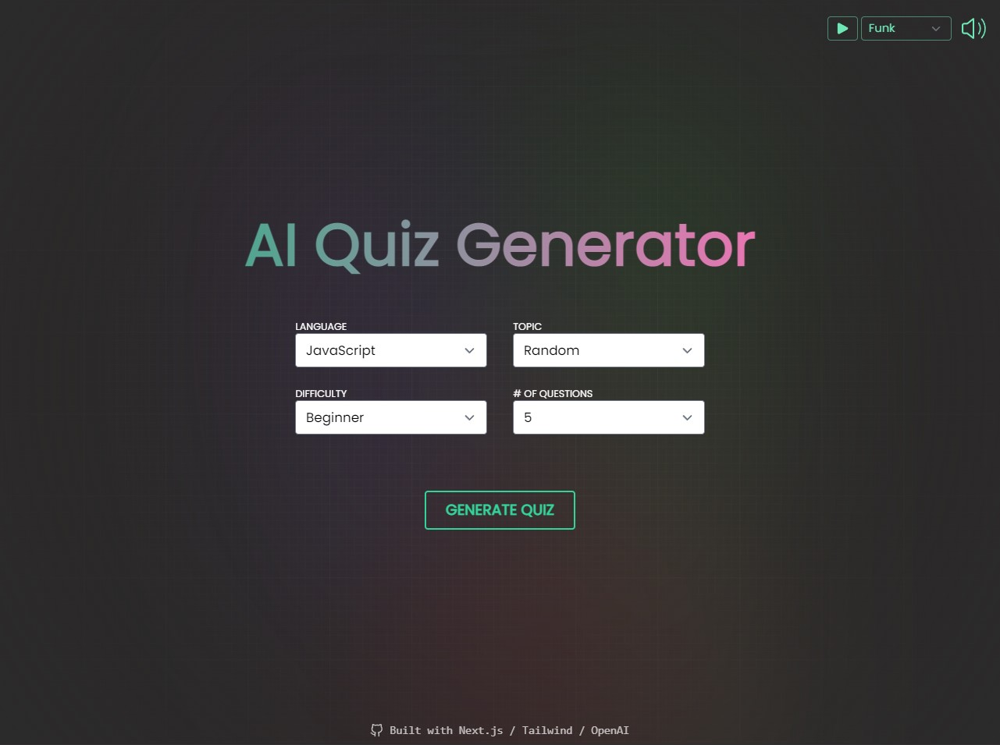
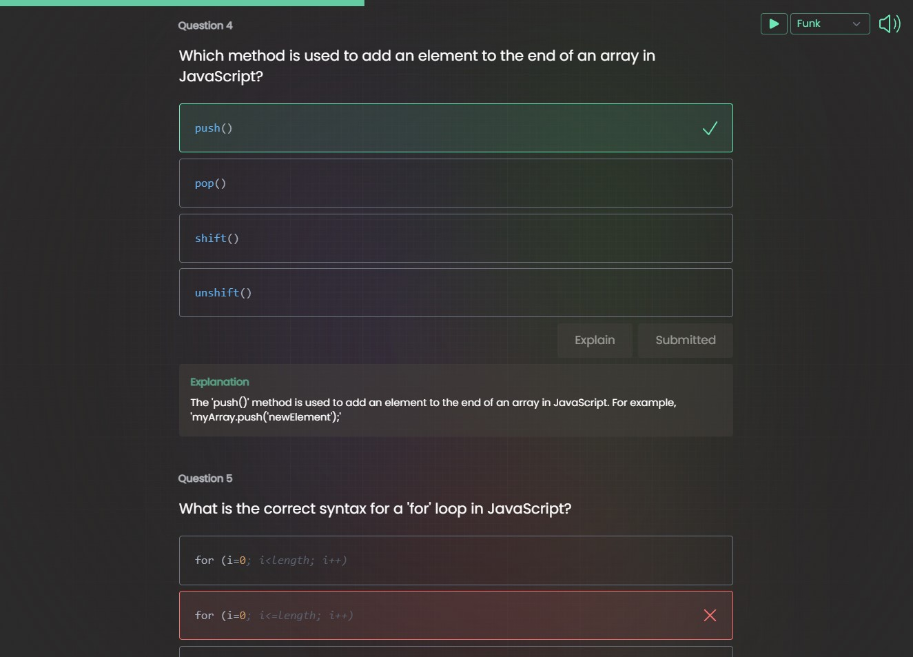

# AI Quiz Generator

An interactive quiz platform powered by AI that generates educational quizzes based on user-defined topics, languages, and difficulty levels.

## Features

- 🎯 Customizable quizzes with user-defined language, topic, and difficulty
- 🎨 Modern dark theme UI with smooth animations
- 🎵 Background music player with multiple tracks
- 📊 Interactive quiz interface with progress tracking
- 🎉 Dynamic end screen with score-based feedback
- 🔒 Secure authentication with NextAuth.js

## Tech Stack

- Next.js 13.4 (App Router)
- React 18
- Tailwind CSS
- DaisyUI
- OpenAI API
- NextAuth.js

## Getting Started

1. Clone the repository:
```bash
git clone <your-repo-url>
cd AI-Quiz-Generator
```

2. Install dependencies:
```bash
npm install
```

3. Create a `.env` file in the root directory and add your environment variables:
```env
OPENAI_API_KEY=your_openai_api_key_here
NEXTAUTH_URL=http://localhost:3000
NEXTAUTH_SECRET=your_nextauth_secret_here
GOOGLE_CLIENT_ID=your_google_client_id_here
GOOGLE_CLIENT_SECRET=your_google_client_secret_here
```

4. Run the development server:
```bash
npm run dev
```

5. Open [http://localhost:3000](http://localhost:3000) in your browser.

## Environment Variables

- `OPENAI_API_KEY`: Your OpenAI API key
- `NEXTAUTH_URL`: Your application URL (http://localhost:3000 for development)
- `NEXTAUTH_SECRET`: A random string for NextAuth.js session encryption
- `GOOGLE_CLIENT_ID`: Google OAuth client ID (if using Google authentication)
- `GOOGLE_CLIENT_SECRET`: Google OAuth client secret (if using Google authentication)

## Contributing

1. Fork the repository
2. Create your feature branch (`git checkout -b feature/amazing-feature`)
3. Commit your changes (`git commit -m 'Add some amazing feature'`)
4. Push to the branch (`git push origin feature/amazing-feature`)
5. Open a Pull Request

## License

This project is licensed under the MIT License - see the LICENSE file for details.

Uses OpenAI's ChatGPT API to generate multiple choice quiz with user defined language, topic, and difficulty.

Features a loading screen with random facts to give the user something to do while the data is retrieved from the API and an ending screen with score-determined gifs and sarcastic messages.

[View Live App](https://ai-quiz-generator-next.vercel.app/)



## Features
- Customisable language, topic, difficulty, and number of questions
- Loading screen that displays the live response stream and random webdev/programming facts (gives you something to do as it can take around 20-30 seconds for the quiz to generate)
- Multiple choice Ed-style quiz with explanations and a progress bar
- End screen with gifs, sarcastic messages, and confetti (>= 80%) that adapt to your quiz score
- 14 track kahoot-flavored audio player (this is the real highlight, the quiz is just something to do while you're groovin :grin:)

## Tech Used

- Next.js 13.4 (using the new App router)
- Tailwind CSS
- OpenAI's `gpt-3-turbo` API

## Packages Used
- [framer-motion](https://www.framer.com/motion/) (for animations)
- [highlight.js](https://www.npmjs.com/package/highlight.js) (for syntax highlighting)
- [react-confetti](https://www.npmjs.com/package/react-confetti)
- [react-loader-spinner](https://www.npmjs.com/package/react-loader-spinner)
- [react-icons](https://react-icons.github.io/react-icons/)
- [react-use](https://github.com/streamich/react-use) (for the `useAudio()` hook)
- [react-simple-typewriter](https://www.npmjs.com/package/react-simple-typewriter)

## Tools ##
- `create-next-app` (development and building)
- Vercel (deployment)

## OpenAI Integration

A custom prompt is created by interpolating user entered form data. Crucially, the response is asked to be returned in JSON format. Light "prompt engineering" was required to ensure the response was consistently in the correct format (for example: explicitly saying what the names of the keys should be).


The API is queried. After playing with the available parameters, I found leaving most of them at their default setting worked well.


## Screenshots




